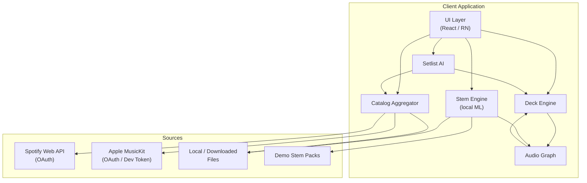
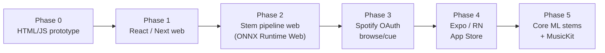
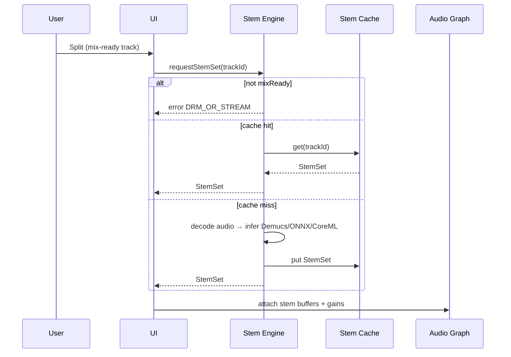
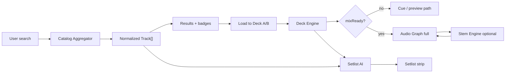

# Autocue — System Architecture

**Cue. Split. Mix. Anywhere.**

This document is the build blueprint for a real Autocue app: client layers, platform path, streaming constraints, stem splitting, cue engine, data models, security, offline, and performance.

---

## 1. Goals & non-goals

### Goals

- Dual-deck cueing & mixing UI across **Spotify**, **Apple Music**, and **Local**.
- **On-device** AI stem splitting for mix-ready audio.
- AI setlist suggestions (harmonic / energy / creative modes).
- Honest product: streaming for browse/cue/metadata; Local for true mix + stems.

### Non-goals

- Circumventing DRM or decoding protected streams for remix.
- Claiming licensed Spotify/Apple full-track offline mix without proper licensing deals.
- Server-side stem farms as the default (privacy + cost); on-device first.

---

## 2. High-level architecture



### Client layers

| Layer | Responsibility |
|-------|----------------|
| **UI** | Dual decks, waveforms, stem faders, setlist strip, browse, badges (mix-ready vs cue-only) |
| **Deck Engine** | Transport state, cue points, sync, pitch, crossfade intent, load Track → DeckState |
| **Stem Engine** | On-device ML (Demucs/ONNX/Core ML); produce `StemSet`; cache; refuse DRM streams |
| **Catalog Aggregator** | Normalize Track metadata from Spotify / Apple / Local; search; readiness flags |
| **Setlist AI** | Rank next tracks by Camelot, BPM, energy; modes (harmonic / energy / AI creative) |
| **Audio Graph** | Web Audio / AVAudioEngine graph: players, stem gains, XF, meters, click/cue feedback |

---

## 3. Platform targets



| Stage | Stack | Notes |
|-------|-------|-------|
| Prototype | Static HTML/CSS/JS (`prototype/`) | No build; mock catalog; oscillators |
| Web app | Vite + React + TypeScript (`web/`) | Dual-deck components; shared tokens; mixReady gating |
| Native | Expo / React Native (`mobile/`) | Expo Router; EAS → TestFlight; Local Mode later |
| Stem web | ONNX Runtime Web / WASM | Heavier; progress UX; optional WebGPU |
| Stem iOS | Core ML export of Demucs-class model | Preferred on-device path for App Store |

---

## 4. Streaming reality (critical)

### What APIs allow

- **Spotify Web API**: OAuth, search, playlists, metadata, **previews** (often ~30s). Playback of full tracks in third-party apps is constrained; Web Playback SDK requires Premium and does not grant stem access or remix rights.
- **Apple MusicKit**: Auth + catalog + player for subscribers. Streams remain DRM-protected; apps do not get raw PCM for arbitrary processing.

### Architectural consequence

```
Streaming track  →  cue / browse / metadata / (licensed preview)
Local / Demo     →  true mix + stem split + export of user-owned stems
```

**Must-haves in every layer:**

1. `Track.mixReady: boolean` (true only for Local / demo packs / explicitly licensed assets).
2. UI banners when loading cue-only tracks onto decks.
3. Stem Engine rejects non–mix-ready sources.
4. Copy never claims “mix Spotify like a USB.”

**Local / Downloaded mode**

- User imports audio files (WAV/AIFF/FLAC/MP3 they own).
- Optional future: partner downloads under license (separate legal track).
- Demo stem packs ship with the app for onboarding when no local files exist.

---

## 5. Stem splitting

### Model path

| Runtime | Target | Notes |
|---------|--------|-------|
| **Demucs** (reference) | Training / export source | State-of-art 4-stem (vocals/drums/bass/other) |
| **ONNX Runtime Web** | Browser / PWA | WASM/WebGPU; large download; progress UI |
| **Core ML** | iOS / iPadOS | Converted model; Neural Engine; App Store friendly |
| **ONNX / ExecuTorch** | Android later | Parallel path post-iOS |

### Stem pipeline flow



### Constraints

- Run on background thread / worker; never block UI audio callback.
- Show ETA; allow cancel.
- Cache by content hash of source file + model version.
- Memory: stream stems to disk when possible; avoid holding 4 full WAVs in RAM on mobile.

---

## 6. Cue engine

Responsibilities of Deck Engine + analysis helpers:

| Feature | Approach |
|---------|----------|
| **BPM detect** | Onset / autocorrelation or embedded metadata; refine on Local |
| **Key detect** | Chromagram → major/minor → **Camelot** wheel |
| **Harmonic matching** | Same / ±1 Camelot, relative major/minor; score for Setlist AI |
| **Crossfade curves** | Linear, constant-power, sharp cut; XF position 0–1 |
| **Sync** | Align BPM (time-stretch) when both decks mix-ready; disable or soft-warn on cue-only |
| **Cue points** | Hot cues C1–C4; quantized optional |

Streaming tracks may use API metadata (BPM/key if available) for **suggestions only**, without claiming analysis of protected PCM.

---

## 7. Data models

```ts
type SourceKind = "spotify" | "apple" | "local" | "demo";

interface Track {
  id: string;
  title: string;
  artist: string;
  album?: string;
  durationMs: number;
  bpm?: number;
  key?: string;          // e.g. "Am"
  camelot?: string;      // e.g. "8A"
  energy?: number;       // 0–1
  source: SourceKind;
  mixReady: boolean;     // false for DRM streams
  artworkUrl?: string;
  previewUrl?: string;   // licensed preview only
  localUri?: string;     // file:// or app sandbox
}

interface DeckState {
  deckId: "A" | "B";
  track: Track | null;
  playing: boolean;
  positionMs: number;
  pitchPercent: number;
  cuePoints: number[];   // ms
  synced: boolean;
  gain: number;
}

type StemName = "vocals" | "drums" | "bass" | "other";

interface StemSet {
  trackId: string;
  modelVersion: string;
  createdAt: string;     // ISO
  stems: Record<StemName, { uri: string; peak?: number }>;
}

interface SetlistItem {
  track: Track;
  reason: string;        // "Camelot +1" | "Energy match" | ...
  score: number;
}

interface Setlist {
  id: string;
  name: string;
  items: SetlistItem[];
  mode: "harmonic" | "energy" | "ai";
}

interface Transition {
  fromTrackId: string;
  toTrackId: string;
  xfCurve: "linear" | "constantPower" | "cut";
  overlapMs: number;
  harmonicScore: number;
  energyDelta: number;
}
```

---

## 8. Data flow (browse → mix)



---

## 9. Audio Graph (conceptual)

```
[Deck A players]
  stemVocals ─┐
  stemDrums  ─┼─→ gainA ─┐
  stemBass   ─┤          │
  stemOther  ─┘          ├─→ master XF ←─┬─ gainB ←─ [Deck B stems]
                         │               │
                    meters / record*     │
                                         │
* record/export only for Local/demo user-owned audio
```

Web: `AudioContext`, `GainNode`s, optional `AudioWorklet`.  
Native: AVAudioEngine / platform equivalents.

Prototype: oscillators + click for feedback; fake waveforms for visuals.

---

## 10. Security & privacy

- OAuth tokens in secure storage (Keychain / encrypted prefs); never log tokens.
- PKCE for Spotify auth.
- Stem jobs stay on-device by default; if cloud ever added, explicit opt-in + retention policy.
- Local files never uploaded without consent.
- Clear separation of preview URLs vs local URIs in the data model.
- No scraping of DRM media paths.

---

## 11. Offline

| Capability | Offline? |
|------------|----------|
| Local library browse | Yes |
| Mix Local / demo | Yes |
| Stem cache replay | Yes |
| Spotify / Apple search | No (needs network) |
| OAuth refresh | Needs network when expired |

Prototype and Local Mode must degrade gracefully with Fog Gray empty states, not crashes.

---

## 12. Performance notes

- Waveform: precompute peaks; render on canvas/OffscreenCanvas; don’t recompute every frame from PCM.
- Stem inference: chunked progress; thermal awareness on mobile; prefer Neural Engine.
- Audio: keep callback light; parameter automation on main/audio thread only as appropriate.
- Catalog: debounce search; cache normalized results; paginate.
- Bundle: lazy-load ONNX WASM; don’t ship stem model on first paint of marketing shell.

---

## 13. Testing strategy (build-time)

- Unit: Camelot distance, XF curves, mixReady gating.
- Integration: Catalog mock → Deck load → Stem reject on Spotify fixture.
- E2E: Prototype transport + faders; later Detox/Playwright for web/native.
- Golden: demo stem loudness / mute behavior.

---

## 14. Related docs

- [PRODUCT.md](./PRODUCT.md) — flows & metrics  
- [HANDOFF.md](./HANDOFF.md) — phase prompts for agents  
- [../prototype/](../prototype/) — interactive UI scaffold  
